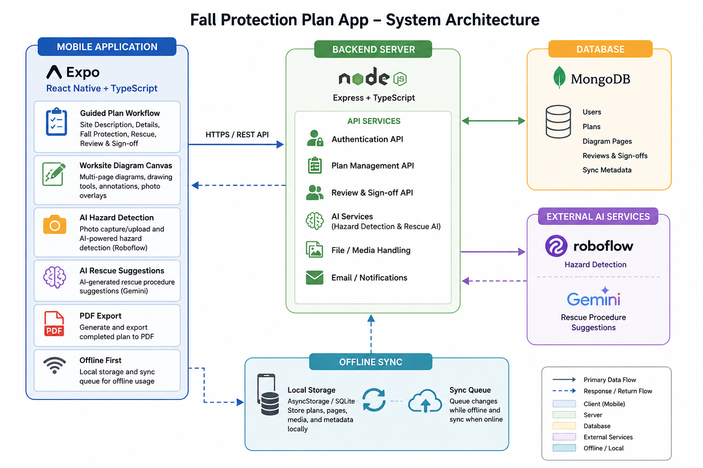
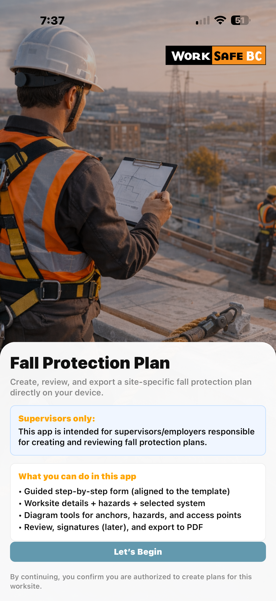
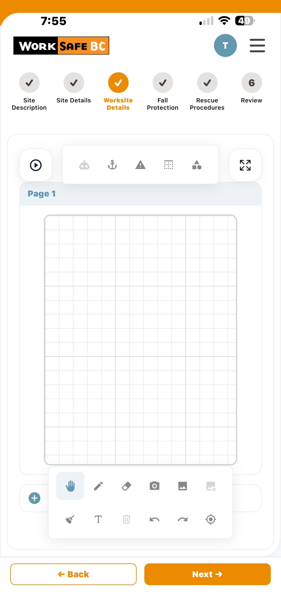
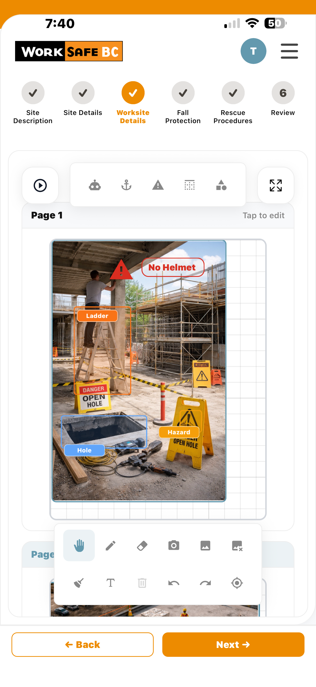
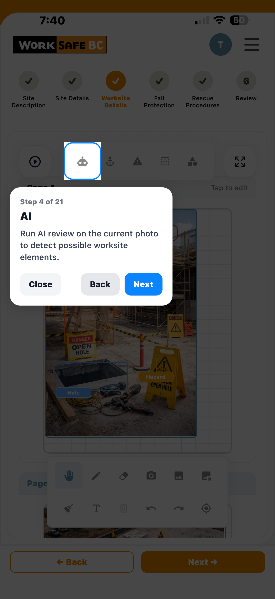
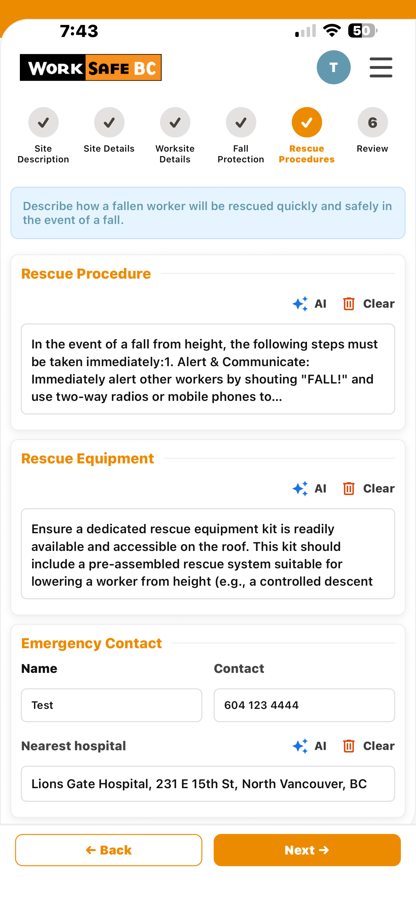
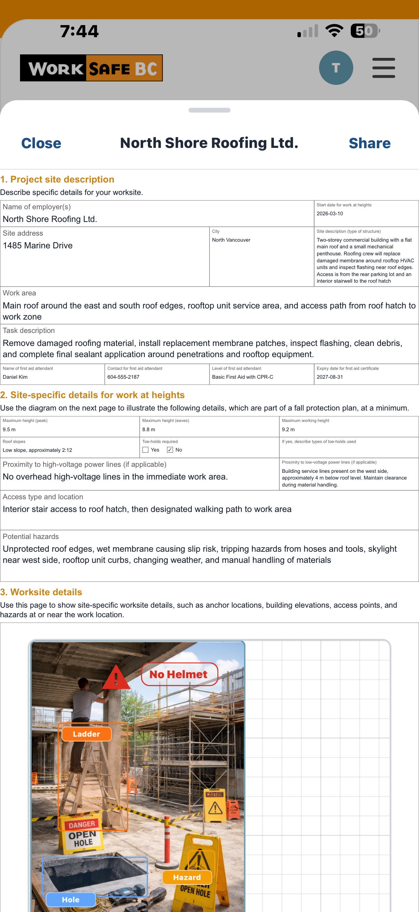

# Fall Protection Plan Mobile Application

> AI-assisted mobile application for digital fall protection planning, worksite diagrams, and offline-first safety workflows.

---

# Overview

The Fall Protection Plan application is a mobile-first system designed to modernize traditional paper-based fall protection planning workflows into a guided digital experience optimized for mobile devices and field conditions.

The application allows workers and employers to:
- Create guided fall protection plans
- Build interactive worksite diagrams
- Detect hazards using AI-assisted image analysis
- Generate rescue procedure suggestions
- Export completed plans to PDF
- Work in offline-first environments

---

# Academic Information

- Institution: British Columbia Institute of Technology (BCIT)
- Program: Computer Systems Technology (CST)
- Course: COMP 3800
- Term: Winter 2026
- Team: Team 21

---

# Technologies

## Mobile Application
- React Native
- Expo
- TypeScript
- Expo Router

## Backend
- Node.js
- Express.js
- MongoDB

## AI Integration
- Roboflow
- Gemini AI

---

# Key Features

- Guided multi-step workflow
- Interactive worksite diagram canvas
- Multi-page diagram support
- Drawing and annotation tools
- AI-assisted hazard detection
- Rescue procedure AI suggestions
- Offline-first synchronization workflow
- PDF export support
- Guided tutorial overlays
- Localization support
- Review and sign-off workflow

---

# Technical Highlights

- Feature-based architecture
- Mobile-first workflow design
- Offline-first synchronization strategy
- AI-assisted workflows
- Canvas-based diagram engine
- Modular frontend/backend separation
- REST API integration
- Scalable backend structure
- Local persistence and sync queue support

---

# System Architecture

  

---

# Application Screenshots

## Home Screen

  

---

## Worksite Diagram Canvas

  

---

## AI Hazard Detection

  

---

## Guided Tutorial Overlay

  

---

## Rescue Procedure AI Suggestions

  

---

## PDF Export Workflow

  

---

# Main Workflow

## 1. Site Description
Capture project conditions, work-at-heights details, and site hazards.

## 2. Site Details
Collect project information and worksite metadata.

## 3. Worksite Diagram Builder
Users can:
- Create multi-page diagrams
- Upload or capture worksite images
- Draw directly on the canvas
- Add anchors, hazards, labels, and roof edges
- Review AI-generated hazard suggestions

## 4. Fall Protection System
Configure fall protection methods and planning details.

## 5. Rescue Procedures
Generate and customize AI-assisted rescue procedure suggestions.

## 6. Review & Export
Review the completed plan and export to PDF.

---

# My Contributions

As Technical Lead and Full-Stack Developer, my responsibilities included:

- Technical coordination and architecture planning
- Backend and frontend integration
- Worksite diagram architecture and implementation
- AI integration workflows
- Offline-first synchronization planning
- Mobile workflow implementation
- PDF export workflow support
- Documentation and technical organization
- Agile collaboration and technical communication

---

# AI Features

## AI Hazard Detection
Images are processed through Roboflow AI services to identify potential hazards and provide assistive visual suggestions for worksite planning.

## Rescue Procedure Suggestions
Gemini AI is used to generate structured rescue procedure draft suggestions based on worksite and project information.

AI functionality is assistive only and always requires user review and approval.

---

# Offline-First Design

The application was designed with field conditions in mind where internet connectivity may be unstable.

Current offline capabilities include:
- Local data persistence
- Diagram state preservation
- Sync queue management
- Deferred synchronization
- Mobile-first workflow continuity

---

# Current Limitations

This project is a strong academic prototype, but some production concerns remain outside the course scope.

## Important Notes
- Not hosted within WorkSafeBC infrastructure
- Not integrated with internal WorkSafeBC systems
- AI services currently rely on external providers
- Production deployment would require:
  - Security review
  - Privacy review
  - Infrastructure alignment
  - Accessibility validation
  - Internal compliance approval

---

# Repository Purpose

This repository is a public showcase version created for portfolio and demonstration purposes.

The original project repository remains private due to academic collaboration, project ownership, and organizational considerations.

---

# Team Members

- Haider Al-Sudani
- Lin Pan
- Haven Zhang
- Jerry Xing

---

# Summary

This project demonstrates a complete end-to-end mobile solution that transforms a traditionally paper-based safety workflow into a scalable, guided, and AI-assisted digital experience while maintaining user review, operational flexibility, and mobile accessibility.
